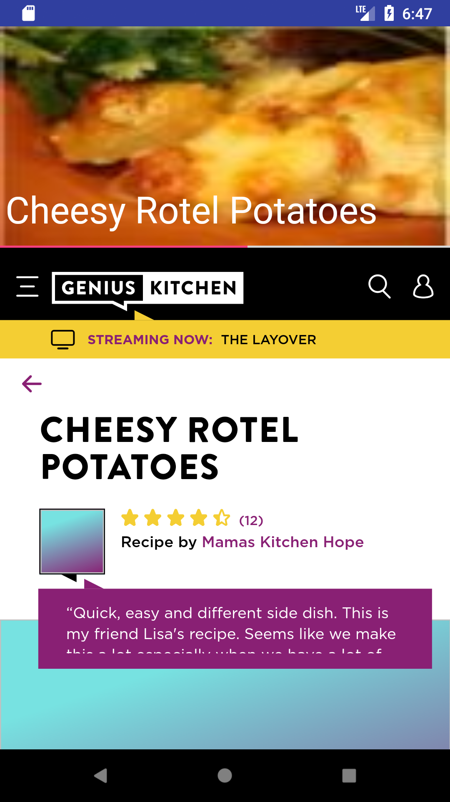

# SimpragmaAssignment

Points completed:
1. Read data from a webservice and display the content in a nice visual fashion. 
2. Bonus 1 - Upon clicking the title/image of the recipe, it should display the details about that recipe.
3. Bonus 2 - If the list of ingredients is greater, then the app should show the results in a pagination view.

All points mentioned in assignment have been completed.

### Instructions to run the app:
1. Download the code from bitbucket.
2. Open the project in Android Studio 3.0 or later.
3. Let it download artifacts.
4. Run the app.

